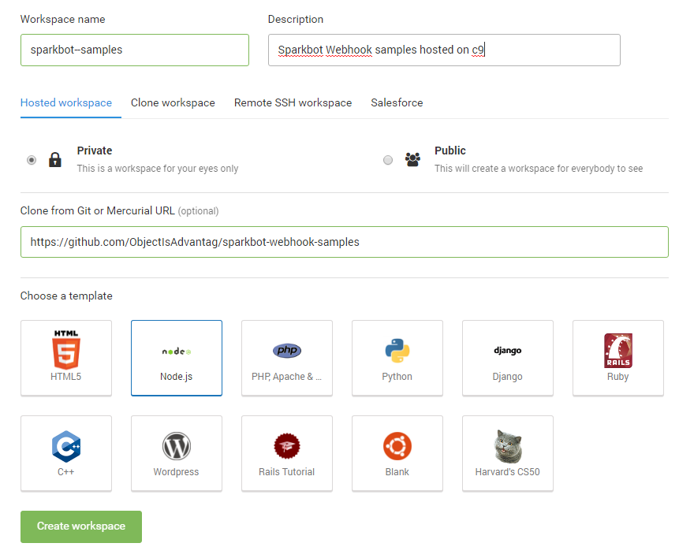
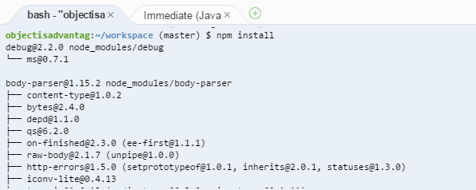
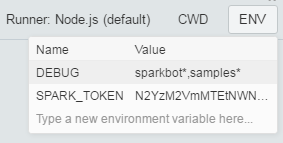
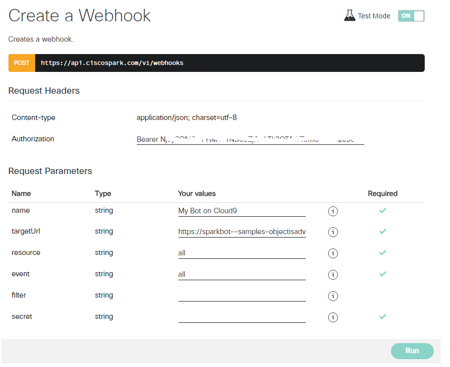

# "How to" Guide: run your Cisco Spark bot on Cloud 9

[Cloud9](https://c9.io/) is a Cloud IDE from which you can edit nodejs source code, but also run and debug your bots.

## Quick start:

### [Sign up](https://c9.io/signup) at Cloud9 

### Create a public Workspace

Clone the [node-sparkbot](https://github.com/ObjectIsAdvantag/sparkbot-webhook-samples) repo, and pick a Cloud9 nodejs __PRIVATE__ template.

__as we leverage Cloud9 visual helper to set environment variables, these will be shared among the Cloud9 commmunity.
Make sure to pick a PRIVATE template to avoid the risk to expose your Cisco Spark API access tokens__

### Install node modules

In Cloud9 bash terminal, run "npm install" in your root folder.

### Choose a test or example

Pick a javascript bot sample in the Cloud9 File explorer on the left, and click run.

### Customize your bot

In Cloud9 Run pane at bottom, set the following environment variables:
- DEBUG: sparkbot*,samples*
- SPARK_TOKEN: paste your Spark token, obtained from https://developer.ciscospark.com/

### Run or debug your bot

As you bot starts, it shows your bot public URL

ex: your code is running at https://sparkbot--samples-objectisadvantag.c9users.io

### Register your bot on Spark 

[Create a Webhook](https://developer.ciscospark.com/endpoint-webhooks-post.html)

note that you can either register a single webhook for all events, or several webhooks for each resource/event your bot listens to.

